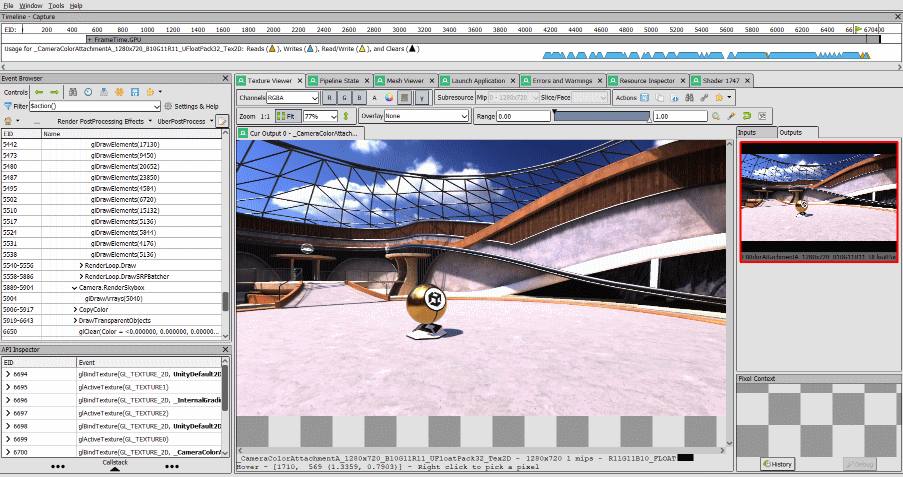
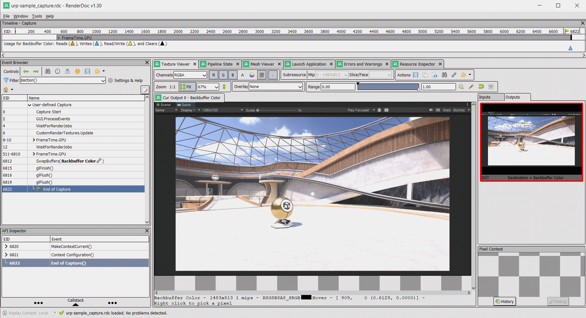
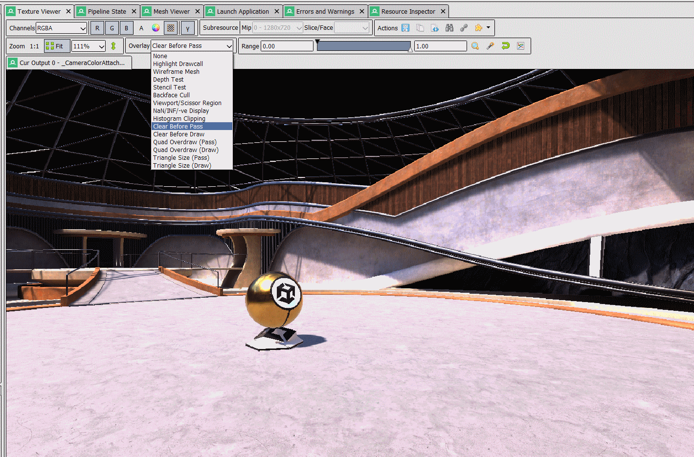
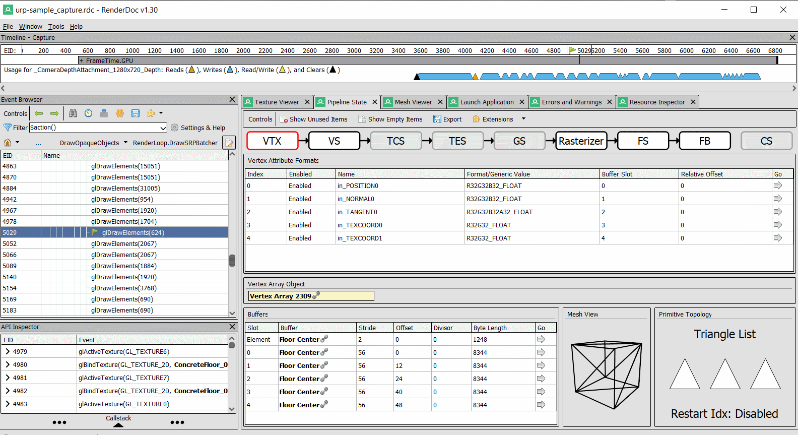
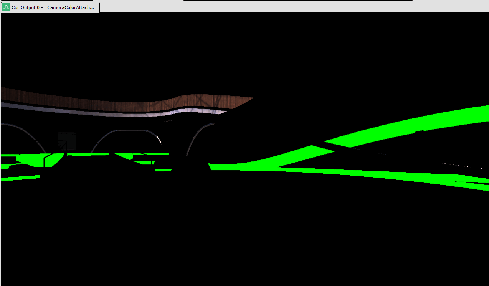
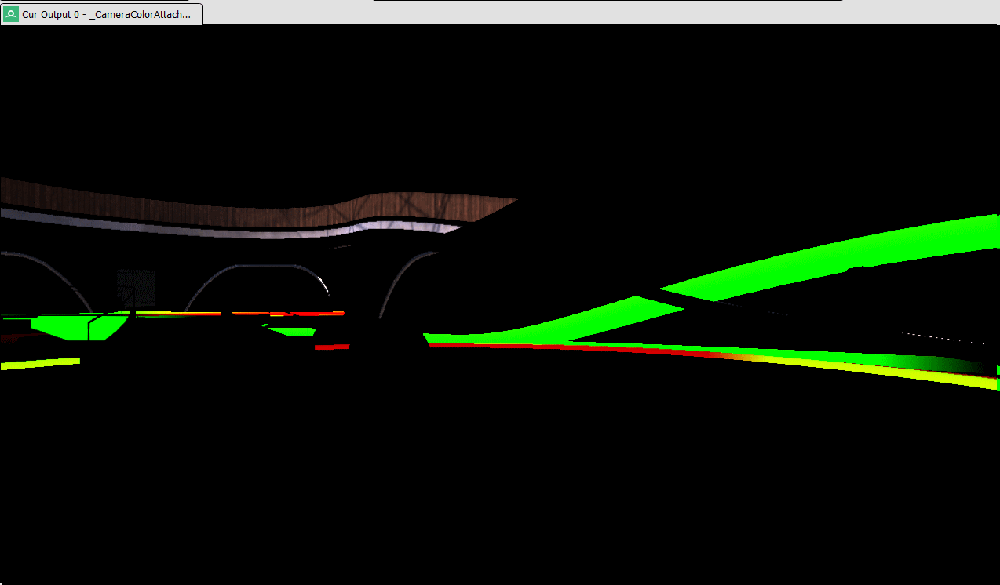

# RenderDoc - Frame Analysis

## Introduction

Dans ce TP, nous allons ouvrir et analyser une capture de jeu à l'aide de RenderDoc.  
La capture a été réalisée dans le template [URP 3D Sample :link:](https://unity.com/demos/urp-3d-sample) du moteur Unity.

Ce template utilise l'Universal Render Pipeline, contenant un bon nombre de features de rendu. Le but ne sera pas
de tout analyser en détail, mais d'apprendre à se servir de RenderDoc pour naviguer à travers la composition de la frame et inspecter les différentes ressources : textures, buffers, shaders etc...

La capture a été réalisé avec l'API *OpenGL* pour être en lien avec le cours de programmation graphique.

???+ abstract "Rendu de TP"
    Un cours compte-rendu de TP est à rendre à la fin de celui ci.  
    Il faudra répondre aux questions encadrées.  
    Pas besoin de mise en page, de simples phrases suffiront. 

!!! info
    Si vous êtes bloqué, n'hésitez pas à solliciter votre encadrant.

## Premiers pas

[Télécharger la Capture (157 Mo) :material-download:](https://noe.masse.pro/content/urp-sample_capture.rdc){ .md-button }

Vous pouvez ouvrir la capture via le menu `File > Open Capture`.

Voici le logiciel une fois la capture ouverte :

* **Event Browser** Cette fenêtre vous permet de naviguer à travers les différentes phases et appels d'API de la frame capturée. Chaque événement possède un ID. Certains sont regroupés par section.
* **Texture Viewer** Cette fenêtre vous permet de visualiser les textures utilisées lors d'un événement.
* **Pipeline State** Cette fenêtre vous permet de visualiser tous les états du pipeline de rendu lors d'un drawcall : ressources attachées, shader utilisé etc...
* **Mesh Viewer** Cette fenêtre vous permet d'inspecter les données du mesh utilisé lors d'un drawcall.
* **Resource Inspector** Toutes les ressources créées sont répertoriées ici.

Pour vous facilier la tâche par la suite, assurez vous que le filtre de l'**Event Browser** soit `$action()`

En ayant le **Texture Viewer** ouvert, ouvrez la section `(EID 511-6810) FrameTime.GPU > UIR.DrawChain` et déplacez vous sur les différents éléments. 

!!! question "Questions"
    D'après vous, à quoi correspondent les sections `GUITexture.Draw` ?  
    Quelle section est la plus susceptible de nous intéresser ?

Comme vous l'aurez vite remarqué, les captures peuvent contenir beaucoup d'événements et de données qui ne nous intéressent pas. Il est donc nécessaire de savoir bien naviguer au sein de celles ci.

## Composition de la Frame

Positionnez vous sur la section `(EID 1427-6715) ScriptableRenderer.Execute: PC_High_Renderer`.  
En gardant le **Texture Viewer** ouvert, naviguez entre les différentes sections.

!!! question
    Décrivez brièvement les différentes passes de rendu du renderer.  
    Pour chaque passe, donner le nom des Outputs et votre intuition sur ce qu'elles représentent.  
    Il est normal que certains outputs soient incompréhensibles.  
    *Ignorez l'événement LightCookies.*  

## Draw Object Passes

On peut voir qu'il y a deux passes principales pour dessiner les objets. Une pour les objets opaques et une pour les objets transparents.

Une particularité du renderer d'Unity est qu'il ne clear jamais sa target de couleur. Il est donc difficile de visualiser les différents drawcalls. Pour se faire, utilisez l'overlay `Clear Before Pass`. Cela permet de forcer le clear de la target avant la passe de rendu.

En naviguant sur les différents drawcalls de `RenderLoop.DrawSRPBatcher`, vous pouvez voir les différents objets se dessiner petit à petit.
Vous pouvez aussi utiliser l'overlay `Hightlight Drawcall` pour mettre en avant l'objet dessiné.

!!! question
    Selectionnez l'output de Depth.  
    Utilisez la baguette pour automatiquement ajuster la range de depth.

      
    
    Que pouvez vous observer entre les différents drawcalls ?

Pour valider votre intuition, choisissez un drawcall et ouvrez la fenêtre **Pipeline State**.

En haut, vous pouvez apercevoir les différent stages du pipeline de rendu que vous conaissez bien.

Cliquez sur le stage `Framebuffer Output (FB)`. Le *Depth State* se trouve en bas.

!!! question
    Décrivez le depth state et validez (ou invalidez) votre intuition.  
    En revenant sur les passes de rendu que vous avez observé, quel lien pouvez vous faire ?

## Étude d'un DrawCall

Choisissez un autre drawcall de la passe `DrawOpaqueObjects` et ouvrez la fenêtre `Pipeline State`.  
Prenez de préférence un drawcall bien visible.

#### Vertex Input

!!! question
    Quels sont les différents attributs définis par Unity ?  
    Unity utilise-t-il un seul ou plusieurs Buffer pour les vertices ?  
    Ecrivez la structure correspondante au modèle de l'objet en C++.

#### Vertex Shader

Fouillez dans les informations disponibles.  
Pour pouvez inspecter les données des uniforms en cliquant sur la flèche dans la section Go.

!!! question
    Où se trouvent les matrices ViewProjection (VP) et ObjectToWorld (M) ?  
    Que pouvez vous déduire des noms des Uniform Buffers ?

#### Fragment Shader

On peut constater que pas mal de ressources sont utilisées par le fragment shader. On y retrouve notamment les ShadowMaps générées apr les passes précedentes.

!!! question "Exercice"

    Ouvre le shader en mode édition :

    

    Le shader est obfusqué mais écrit en glsl.  
    Modifiez le shader pour que l'objet dessiné soit vert (0, 1, 0).

    

???+ question "Exercice (Bonus)"

    Comme pour l'exercice précédent, modifiez le shader pour qu'il affiche les UVs de l'objet.  
    Vous aurez besoin d'aller voir le code du vertex shader.

    

## Pour aller plus loin

Nous avons fait le tour de fonctionalités de base. 
Pour aller plus loin, vous pouvez vous rendre sur la [documentation officielle :link:](https://renderdoc.org/docs/introduction.html).
